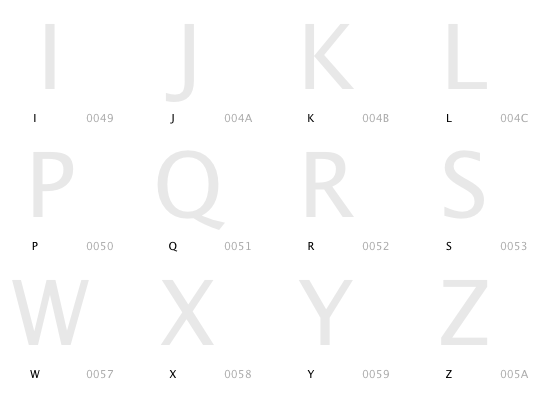
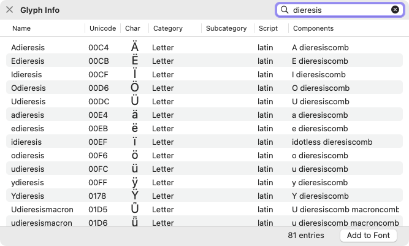
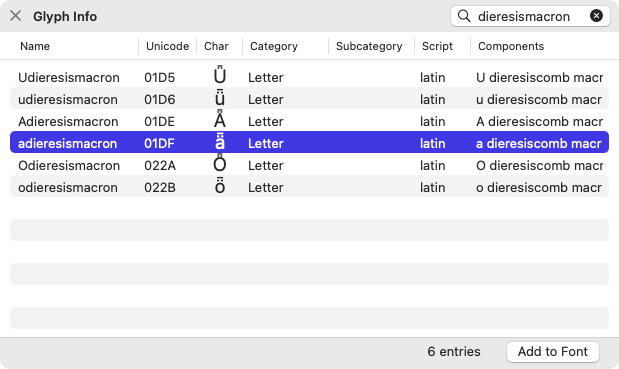
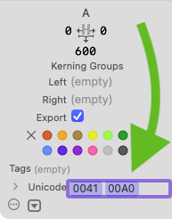
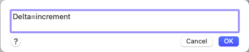
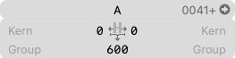
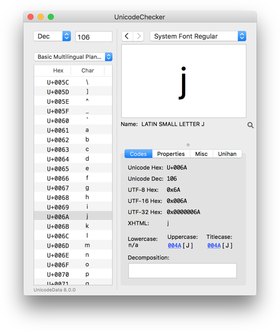
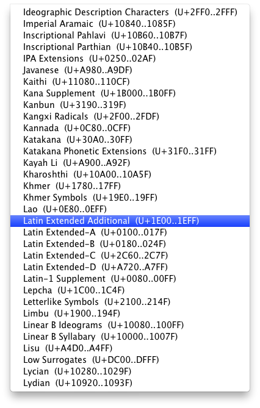

原文: [Unicode](https://glyphsapp.com/learn/unicode)
# Unicode

チュートリアル

[ OpenTypeフィーチャー ](https://glyphsapp.com/learn?q=opentype+features) [ スクリプト ](https://glyphsapp.com/learn?q=scripting)

執筆者: Rainer Erich Scheichelbauer

[ en ](https://glyphsapp.com/learn/unicode) [ fr ](https://glyphsapp.com/fr/learn/unicode) [ zh ](https://glyphsapp.com/zh/learn/unicode)

2022年7月27日更新（初版公開：2013年2月12日）

フォントが正しく機能するためには、一部のグリフに適切なUnicodeが必要です。ここでは、書体デザイナーとして知っておくべきUnicodeの要点を解説します。

## キャラクターとグリフ

書体デザイナーが作るのは新しい*グリフ*、つまりキャラクターを表現する*絵*です。書体デザイナーは通常、新しい*キャラクター*、つまりその絵の*意味*、あるいはより専門的に言えば「[意味を持つ書記言語の最小構成要素](http://www.unicode.org/glossary/#character)」を作ることはありません。私たちはアルファベットを発明するのではなく、既存のものを再解釈するだけです。（まあ、時には新しいアルファベットを発明することもありますが、それはまた別の話です。落ち着いて読み進めてください。）

要するに、キャラクターは入力するもの、グリフは目にするものです。

一つのグリフは通常、文字であれ、数字であれ、句読点であれ、一つのキャラクターに対応します。キャラクターにはUnicodeがあります。グリフとキャラクターの関係は、グリフに関連付けられたUnicode値によって表現されます。Glyphsは様々な方法でUnicode値を表示します。例えば、フォントビューでは、グリフ名のすぐ隣に表示されます。

グリフは一度に複数のキャラクターを表すこともできます。例えば、`f_f_f`という合字（リガチャ）を考えてみましょう。これは3つのfのキャラクターが連続したものを表します。合字にはUnicodeがありません。なぜなら、個々のキャラクターにはすでにコードがあり、合字であるという事実がその構成部分の意味を変えるわけではないからです。（まあ、実際には、一部の合字にはレガシーコードが存在しますが、それはとうの昔に過ぎ去った8ビットコンピューティングの暗黒時代に作られた古いエンコーディングとの後方互換性のためだけです。例えば、`f_f`には`U+FB00 LATIN SMALL LIGATURE FF`というコードポイントがあります。「8ビット」と聞いて何も思い浮かばない方は、この括弧内で読んだことはすべて、ただちに記憶から消去してください。落ち着いて読み進めてください。）

時には、グリフは他のグリフの一部としてのみ機能することもあります。例えば、[セリフに別々のグリフを使用する](serif-components/.md)ことができます。つまり、まとめると、グリフとは、キャラクターの絵、多くのキャラクターの絵、または他のグリフの一部分としての絵のことです。そして書体デザイナーはそのような絵を描くのです。

## Unicode、面、ブロック

何世紀にもわたり、アルファベットは単なるaからzまでよりも複雑なものになりました。まず、あらゆる種類のダイアクリティカルマーク、特殊文字があり、その（ほぼ）すべてに大文字と小文字の両方が存在します。そして、ラテン文字だけでなく、もっともっと多くの文字体系があります。さらに、何百、何千もの記号、数字、句読点などなどがあります。

手短に言えば、すべてを把握する方法が必要なのです。すべての文字体系のすべてのキャラクターを網羅した巨大な表のようなもの、本質的にはどこでもテキストの一部として入力したいと思う可能性のあるすべてのものです。さて、これが[Unicode](http://en.wikipedia.org/wiki/Unicode)と呼ばれるものです。

Unicodeは、コードと記号、そして多くのメタデータを対応付ける表です。個々のコードを表現する方法はいくつかあります（Unicode変換形式、またはUTFとして知られています）。Glyphsは16進数のUTF-16規約を使用しています。[16進数](http://en.wikipedia.org/wiki/Hexadecimal)とは、ご存じない方のために説明すると、通常の10個の数字の代わりに16個の数字で数える方法です。追加の数字としてAからFまでの文字を使い、0, 1, 2, 3, 4, 5, 6, 7, 8, 9, A, B, C, D, E, F, 10, 11, 12, 13, 14, 15, 16, 17, 18, 19, 1A, 1B というように数えます。お分かりですね。

Unicodeには、それぞれ65,536キャラクターを収容する[17個の面（プレーン）](http://en.wikipedia.org/wiki/Plane_\(Unicode\))があり、最も重要なのは`U+0000`から`U+FFFF`までの基本多言語面（BMPまたは面0）と、`U+10000`から`U+1FFFF`までの追加多言語面（SMPまたは面1）です。面は多くの[文字ブロック](http://en.wikipedia.org/wiki/Unicode_block)に細分化されており、通常は一つの文字体系を含みます。例えば、`U+0B80`から`U+0BFF`までのタミル文字や、顔文字（`U+1F600`から始まる）のような面白いものもあります。

Unicodeのすべてのコードポイント（17×65,536=1,114,112個）が現在使用されているわけではありません。これを書いている時点での最新のUnicode標準は、2021年9月の[バージョン14.0.0](http://www.unicode.org/versions/latest/)で、144,697キャラクターが定義されています。Unicodeの一部は意図的に私的使用のために空けられています。Unicodeにはそのような[私用領域](http://en.wikipedia.org/wiki/Private_Use_\(Unicode\))が3つあり、最も重要なものは`U+E000`から`U+F8FF`までの範囲です。

[クリンゴン語のpIqaD](http://en.wikipedia.org/wiki/Klingon_writing_systems)のように、公式のUnicodeに入る可能性が低い非公式な文字体系のために、マニアたちは私用領域を利用した[ConScript Unicode Registry](http://www.evertype.com/standards/csur/)を考案しました。

## UnicodeとGlyphs

Glyphsでは通常、Unicodeについて心配する必要はありません。なぜなら、Glyphsはグリフ名によって正しいコード（またはコードの有無）を決定するからです。「ウインドウ > グリフ情報（Window > Glyph Info）」（Cmd-Opt-I）を開き、検索フィールドにグリフ名（の一部）を入力して特定のグリフを探します。

Glyphsには、あらかじめ定義されたグリフ名のデータベースが内蔵されています。その気になれば、[独自の定義を追加する](roll-your-own-glyph-data/.md)こともできます。「グリフ情報」ウィンドウには、各グリフの名前、Unicode（あれば）、およびいくつかのメタデータが表示されます。Glyphsバージョン1.3.18以降では、グリフを選択して右下隅の「フォントに追加」ボタンを押すことで、簡単にフォントにグリフを追加できます。

「グリフ情報」ウィンドウのサイズを変更すると、個々のグリフの非常に便利な分解情報も見ることができます。

例えば、`adieresismacron`をフォントに追加する予定がある場合、フォントに`a`、`dieresis`、`macron`がすでにあることを確認してください。そうすれば、Glyphsはそれらを`adieresismacron`のコンポーネントとして使用し、完全なグリフをすぐに構築できます。便利ですね。

「グリフ情報」ウィンドウに登録されていないグリフを追加する予定がある場合は、`uniXXXX`という命名規則を使って基本多言語面のキャラクターに関連付けることができます。XXXXは4桁のUTF-16の16進数コードを表します。それより上位の面には`uXXXXX`を使用します。つまり、`uni`の代わりに`u`を使うだけです。そうすると、Glyphsは自動的に適切なUnicodeを追加します。

すべてのグリフにUnicodeが必要なわけではないことを覚えておいてください。特に、グリフがOpenType機能によって呼び出される場合、そのグリフをエンコードする必要はありません。コードが必要なのは、直接入力する必要がある場合だけです。例えば、スモールキャップや文字のスタイルバリエーションをエンコードする必要はありません。ユーザーはテキストを通常の大文字・小文字で入力し、その後、使用しているソフトウェアの適切な機能を有効にするからです。

## 同じシェイプに複数のUnicode値

2つのUnicode値の間で同じグリフシェイプを共有したい場合はどうすればよいでしょうか？それが必要になる状況はいくつかあります。例えば、記号の*インクリメント*`U+2206`とギリシャ文字の*デルタ*`U+0394`は同じように見えるべきです。*オーム*`U+2126`と*オメガ*`U+03A9`にも同様の問題があります。あるいは、[オールキャップスフォントを作成している](creating-an-all-caps-font.md)場合などです。または、単に同じスペースグリフを*スペース*`U+0020`と*ノーブレークスペース*`U+00A0`の両方に再利用したい場合もあるでしょう。

選択肢は2つあります。*ダブルマッピング*か*ダブルグリフ*です。

1.  **ダブルマッピング：** 同じグリフに*複数の*Unicode値を与えます。これを行うには、Unicodeフィールドをクリックして2番目のUnicode値を入力するだけです。例えば、スペースグリフに`0020`の隣に`00A0`を追加して、Returnキーを押します。

    

    これには、ファイルサイズを小さく保つという利点があります。そのため、できるだけ小さくする必要があるWebフォントには良い方法かもしれません。欠点として、ダブルマッピングを含むフォントで組まれたPDFからテキストをコピーする際に問題が発生します。（これについて詳しく知りたい場合は、[オールキャップスチュートリアル](creating-an-all-caps-font.md)の「Problems with Double Encodings」セクションを読んでください。）それでも私たちはこの方法を推奨します。なぜなら、PDFからのテキスト抽出は非常に多くの点で問題があり、いずれにせよ絶望的なケースなので、涙を流す価値はありません。

2.  **ダブルグリフ：** 簡単なレシピを使って、グリフを*コンポーネントコピー*として複製できます。コンポーネントコピーとは、ただ一つの他のグリフをコンポーネントとして持つグリフのことです。コンポーネントが自動整列される場合、オリジナルと複製は常に同期します。[レシピ](recipes.md)を使えば、コンポーネントコピーを簡単に作成できます。「グリフ > グリフを追加…（Glyph > Add Glyphs…）」（Cmd-Shift-G）を選択し、元のグリフ名、等号、そして複製の名前の順に入力します。

    例：すでにギリシャ文字のデルタがあり、それをインクリメント記号として再利用したい（そして上記のPDFテキスト抽出の問題が気になる）とします。Cmd-Shift-Gを押して「グリフを追加…」ダイアログを呼び出し、`Delta=increment`と入力して、「Generate」を押します。

    

    *スペースグリフ*を同一に保ちたい場合は、もちろんコンポーネントは必要ありません。幅にメトリクスキーを使用する方がはるかに賢明です。例えば、ノーブレークスペースを通常のスペースと同じにしたい場合は、`nbspace`グリフを編集用に開き、「幅」フィールドに`=space`と入力します。その後、「グリフ > メトリクスを更新（Glyph > Update Metrics）」（Ctrl-Cmd-M）を選択して、グリフの幅が同期していることを確認します。あるいは、複数のマスターがある場合は、Optionキーを押しながら行うと、コマンドが魔法のように「すべてのマスターでメトリクスを更新」に変わります。便利ですね。メトリクスキーについては、[スペーシングのチュートリアル](spacing.md)で詳しく説明しています。

## UnicodeChecker

Glyphsは、[Earthling Soft](http://earthlingsoft.net)の素晴らしい人々が開発した[UnicodeChecker](http://earthlingsoft.net/UnicodeChecker/)というシェアウェアツールと連携できます。UnicodeCheckerは、キャラクターに関する必要な情報をすべて素早く見つけるのに役立ちます。UnicodeCheckerを呼び出すには、グレーの情報エリアにあるUnicodeの隣の小さな矢印をクリックします。

すると、Glyphsは現在のグリフのコードをUnicodeCheckerに送信し、UnicodeCheckerは問題のキャラクターに関するあらゆる種類の有用な情報を教えてくれます。

UnicodeCheckerは、ある文字体系に関連するすべてのキャラクターを素早く見つけるのにも役立ちます。例えば、本当にすべてのラテン文字をカバーしたい場合は、UnicodeCheckerに切り替え、「Character Blocks > Alphabetically: Ideographic-Lydian」サブメニューで、すべてのラテン文字ブロックを見つけることができます。

まだUnicodeCheckerをインストールしていない場合、矢印をクリックするとインストールを促されます。UnicodeCheckerのダウンロードとインストールは無料です。しかし、定期的に使用する場合は、この小さなツールがどれだけの時間と神経を節約してくれるかを考え、開発者への[寄付を検討](https://www.paypal.com/xclick/business=earthlingsoft%40earthlingsoft.net&item_name=UnicodeChecker&no_shipping=1&cn=Comments&tax=0&currency_code=EUR&lc=GB)してください。シェアウェアをサポートしましょう。それはあなたをサポートしてくれます。

---

更新履歴 2019-02-13: Unicode 11.0.0に合わせて変更し、リンクを更新。「ダブルマッピング」を書き直し。

更新履歴 2022-08-03: Unicode 14.0.0に合わせて変更、スクリーンショット、関連記事を更新、軽微なフォーマット修正。