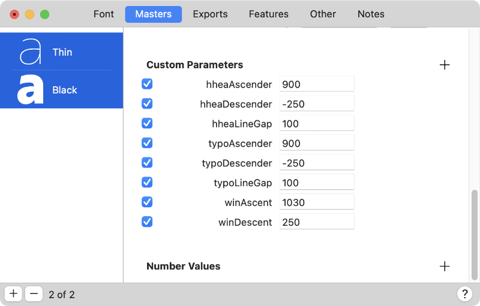
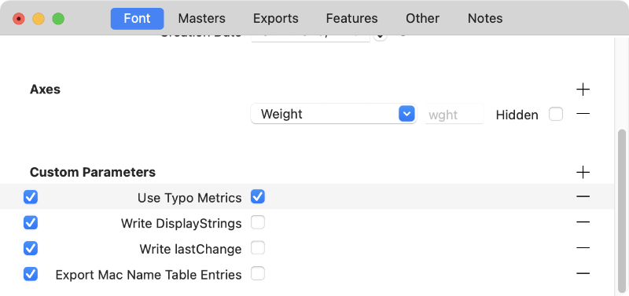
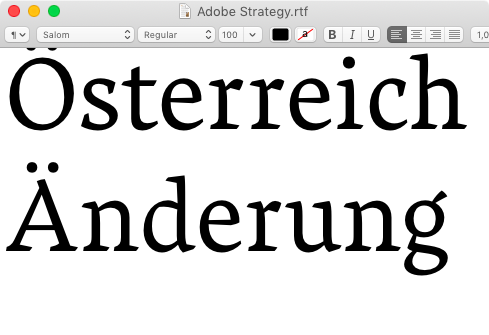
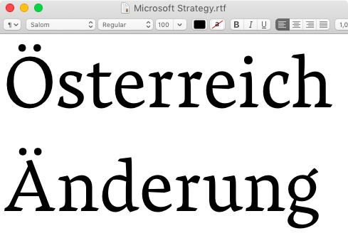
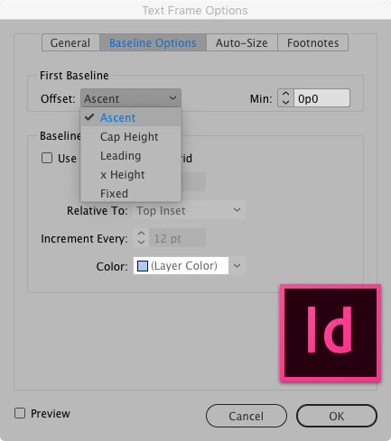
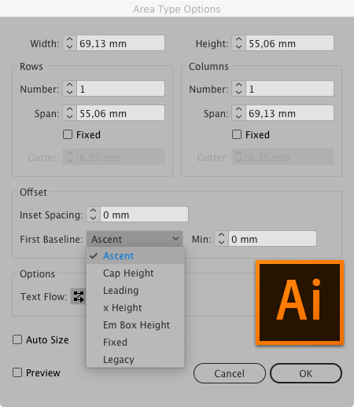
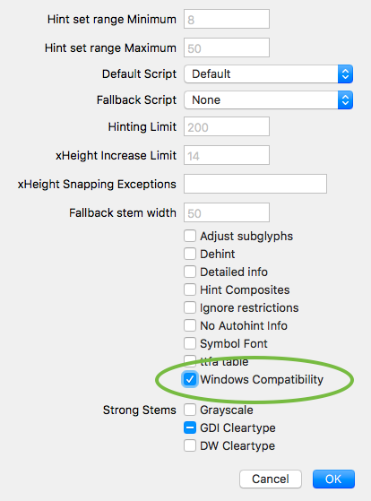
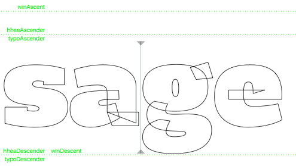
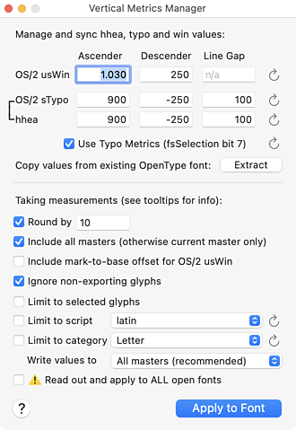

原文: [Vertical metrics](https://glyphsapp.com/learn/vertical-metrics)
# バーティカルメトリクス

チュートリアル

執筆者: Rainer Erich Scheichelbauer

[ en ](https://glyphsapp.com/learn/vertical-metrics) [ fr
](https://glyphsapp.com/fr/learn/vertical-metrics) [ zh
](https://glyphsapp.com/zh/learn/vertical-metrics)

2025年3月12日更新（初版公開：2012年7月10日）

バーティカルメトリクスは、テキストの最初のベースラインの位置、行と行の間の距離、そして最後のベースラインの下にある次のオブジェクトまでの余白を決定します。

歴史的な理由から、フォントファイル内にはバーティカルメトリクスを扱う設定値が実に*3種類*も存在します。それらは`hhea`、`typo`（`sTypo`や`OS/2.typo`としても知られる）、そして`win`（または`usWin`）メトリクスとして知られています。どのOSやどのアプリケーションを使っているかによって、画面上でフォントをレンダリングするために異なる設定値が使用されます。

残念ながら、これらの値はすべて非常に複雑な方法で互いに関連しています。幸いなことに、Glyphsは各マスターに入力されたバーティカルメトリクス（アセンダー、キャップハイト、エックスハイト、ディセンダー）を元にこれらを自動計算するよう最善を尽くします。しかし、これらの値がマスター間で異なっていると、問題が発生する可能性があります。

## カスタムパラメータ

そのため、ファミリー内の異なるフォントを切り替えたときに垂直方向のズレを避けるには、*すべてのマスターですべての値を同期させる*のが良い方法です。これを行うには、「ファイル > フォント情報 > マスター（File > Font Info > Masters）」（Cmd-I）でカスタムパラメータを使用します。

1つのマスターで値を設定し、そのパラメータを他のすべてのマスターの「カスタムパラメータ」フィールドにコピー＆ペーストするか、すべてのマスターを同時に選択して一括編集します。イタリック用に別のファイルがある場合は、その値を他のファイルにもコピー＆ペーストするのを忘れないでください。

しかし、これらの値は何を意味するのでしょうか？簡単に説明しましょう。

## hhea

`hhea`という名前は、`hhea` OpenTypeテーブルを指します。「hhea」は[Horizontal Header Table](https://learn.microsoft.com/typography/opentype/spec/hhea)の略で、ラテン文字、ヘブライ文字、ギリシャ文字、ジャワ文字、アラビア文字、タイ文字などの水平書字用の一般的なフォント情報（「ヘッダー」とも呼ばれる）を意味します。Mac、iPhone、iPadなどのAppleデバイスは、レンダリングにこれらの値を使用します。`hhea`テーブルには3つのバーティカルメトリクス値があります。便宜上、Glyphsが使用するカスタムパラメータ名と共にここにリストします。

### 注意
最近のAppleシステムでは、フォントに[STATテーブル](https://learn.microsoft.com/typography/opentype/spec/stat)が含まれ、かつ*Use Typo Metrics*がオンになっている場合、`hhea`値よりも`typo`値が優先されます。デフォルトでは、Glyphsが書き出すすべてのバリアブルフォントには`STAT`テーブルが含まれ、Glyphs 3以降では、すべての書き出しで*Use Typo Metrics*がデフォルトでオンになっています。`STAT`テーブルの書き出しは、「ファイル > フォント情報 > 書き出し」の*Export STAT table*パラメータで強制（または抑制）できます。

1.  `hheaAscender`: アセンダーの高さ（ユニット単位）
2.  `hheaDescender`: ディセンダーの深さ（ユニット単位、負の値）
3.  `hheaLineGap`: 推奨される行間の空白

`hhea`値はMacアプリやApple製品全般（iPhone、iPadなど）で優先的に使用されてきました。これは徐々に変化しており、Mac上のますます多くのアプリが代わりに`typo`値を使用するようになっています（後述）。

`hhea`値を使用するWebブラウザは、`hheaLineGap`の半分を`hheaAscender`の上に、半分を`hheaDescender`の下に追加して、一行のテキストを囲む最小の`
`を計算します。詳細は後述します。

## OS/2 sTypo (typo)

これらの値は`OS/2` OpenTypeテーブル、正式名称では[OS/2 and Windows Metrics Table](https://learn.microsoft.com/typography/opentype/spec/os2)の一部です。同名のオペレーティングシステムを覚えている人はいますか？タイポグラフィのプロは、バーティカルメトリクスのおかげで毎日それを思い出しています。これらは`sTypo`や単に`typo`値とも呼ばれます。ちなみに、`s`は「signed（符号付き）」の略で、値は負にも正にもなり得ます。「OS/2値」と呼ぶデザイナーもいますが、`win`値もOS/2テーブルの一部なので、これは少し不正確です。

1.  `typoAscender`: アセンダーの高さ（ユニット単位）
2.  `typoDescender`: ディセンダーの深さ（ユニット単位、負の値）
3.  `typoLineGap`: 推奨される行間の空白

[Yannis Haralambousの著書](http://shop.oreilly.com/product/9780596102425.do)（p.724）を引用すると、これらの値は「hheaテーブルのascent、descent、lineGapと奇妙なほど似ていますが、必ずしもそれほど正確であったり、グリフのアウトラインの気まぐれに密接に結びついているわけではありません。Windowsはレイアウトの理想的なパラメータを見つけるためにこれらの値を使用するとされており、したがって我々にはある程度の芸術的自由があります。」しかし、一般的な慣行としては、`typo`と`hhea`の値を同期させておくことです。なぜなら、異なるアプリが全く同じ目的、つまり最初のベースラインの位置、後続のベースラインまでの距離、そして上下のレンダリングスペースの確保のために、どちらかの値を使用するからです。

XPressやInDesignなどの主要なレイアウトアプリや、他のプロフェッショナルなデザインソフトウェアは、テキストボックスの最初のベースラインのオフセットを決定するために`typoAscender`値を、またテキストの表示が抑制されるテキストボックスの最小サイズのために`typoDescender`を使用することができます。ただし、これらのアプリのほとんどは、これらのオフセットを計算するための代替手段を提供しています。DTPアプリでは、行間はユーザーによって制御されるべきものとされており、デフォルトは通常フォントサイズの20%であるため、`typoLineGap`は無視されます。

Officeソフトウェアやブラウザは、*Use Typo Metrics*パラメータがyesに設定されていれば、`win`値（後述）よりも`typo`値を優先するはずです。これは現代のフォントでは常にそうあるべきです。Officeアプリでは、`typoLineGap`が尊重されます。

繰り返しになりますが、OS/2 typo値を使用するWebブラウザは、`typoLineGap`の半分を`typoAscender`の上に、半分を`typoDescender`の下に追加して、一行のテキストを囲む最小の`
`を計算します。しかし、いつものように、話はそれだけではありません。詳細は後述します。

### UPMドグマ

ただし、注意すべき点が1つあります。「UPMドグマ」です。電子組版の暗い過去において、TrueType/OpenTypeの仕様では、`typoAscender`から`typoDescender`までの範囲がフォントのUPM（通常は1000または2048）と同じ大きさであるべきだと定められていました。これにより、物事は非常に複雑になっていました。

数年前、ラテン文字とは異なるメトリクスを必要とするスクリプトでは機能しないという理由で、「UPMドグマ」は批判の的となりました。UPMドグマからの脱却を提唱した一人に、SILのVictor Gaultney氏がいます。彼は[Best Practice: Design Metrics](http://silnrsi.github.io/FDBP/en-US/Design_Metrics.html)と[Best Practice: Line Metrics](http://silnrsi.github.io/FDBP/en-US/Line_Metrics.html)の両方を執筆しました。

その間、ドグマは[OpenTypeの仕様](https://docs.microsoft.com/en-us/typography/opentype/spec/os2#stypoascender)から完全に削除されました。

> sTypoAscender - sTypoDescenderがunitsPerEmと等しいことは一般的な要件ではありません。これらの値は、フォントがサポートするように設計された主要な言語に適したデフォルトの行間を提供するために設定されるべきです。

それでも、UPMドグマは後述する（レガシーな）AdobeとMicrosoftの戦略で依然として役割を果たしています。しかし、現代のフォントでは、安全に無視することができます。

## OS/2 usWin (win)

`usWin`、または略して`win`値も`OS/2`テーブルの一部です。`us`は「unsigned（符号なし）」の略で、正の値のみが可能であることを意味します。

1.  `winAscent`: フォントレンダリングボックスの上端
2.  `winDescent`: フォントレンダリングボックスの下端（正の値）

注意：これらの値を超えて上下に伸びるものは、Windowsのテキストエンジンによってレンダリングされる際に切れてしまう可能性があります。したがって、最も簡単な方法は、フォント内の*すべて*が`win`の範囲内に収まるようにすることのようです。通常、フォントで行うことは`win`の範囲を超えることはありません。

### プロのヒント
フォント内の最も高い点と低い点を見つけるには、[mekkablue script](glyphsapp3://showplugin/mekkablue%20scripts)の*Test > Report Highest and Lowest Glyphs*を試してみてください。各マスターについて、すべてのグリフの最も高い点と最も深い点がリストされます。

`win`値は`hhea`や`typo`の値から切り離すことができます。第一に、それらが異なることを行うためです。`win`はクリッピング（文字が切れること）を担当し、他はベースラインのオフセットを見つけるため、ひいては周囲のボックスの寸法を決めるために使用されることになっています。第二に、`win`値にはラインギャップがありません。しかし、もし`win`を他の値セットと同期させたい場合は、`hheaLineGap`と`typoLineGap`の値をゼロに設定する必要があります。

とはいえ、そう単純ではありません。古い時代、Windowsはすべてのことに`win`値を使い、`typo`値にはあまり関心がありませんでした。次の章をご覧ください。

フォントが、アラビア語の母音記号や多くのブラーフミー系文字の母音のように、マーク対ベースおよび/またはマーク対マークの位置決めを利用するスクリプトをサポートしている場合、`win`値にマーク配置の可能性のための余分なスペースを含めるのも良い考えです。そうしないと、結合マークが切れてしまう危険があります。

## Use Typo Metrics

もう一つあります。古い（2006年以前の）MS Officeバージョンを安全に無視できる場合は、「ファイル > フォント情報 > フォント」に*Use Typo Metrics*パラメータを追加すべきです。

しかし、忘れてしまってもあまり心配しないでください。Glyphsがバージョン3を超えてからは、*Use Typo Metrics*はデフォルトでオンになっています。いずれにせよ、これがオンになっていると、この設定を尊重するアプリケーション（特に2006年以降のMicrosoft Officeのバージョン）は、垂直方向の位置決めを決定する際に、*winAscent*と*winDescent*よりも*typoAscender、typoDescender、typoLineGap*を優先します。

技術的には、これは`OS/2`テーブルの`fsSelection`フィールドのビット7（「Winラインメトリクスを使用しない」）を設定するものです。MakeOTFユーザーガイドによると、このビットは「Microsoftがすべてのフォントの挙動を変更した場合よりも、ドキュメントの再フローが起こりにくくなるように」導入されたものです。言い換えれば、**非常に正当な理由がない限り、すべての現代的なフォントはタイポメトリクスを使用すべきです**。

悲しいかな、正当な理由の一つとして、このパラメータを使用すると、レガシーなOfficeソフトウェア（2006年以前）が`win`値ではなく`typo`値でクリッピングを適用する可能性があることが挙げられます。古いソフトウェアをサポートする必要がある立場にある場合は…残念です。それ以外の誰もが、これを過去の問題と見なす権利があります。

もう一つの問題は、Microsoft Officeソフトウェアでは、*Use Typo Metrics*がオンの場合、`underlinePosition`と`underlineThickness`の値が無視されることです。オフであっても、下線が`winDescent`の上に収まらない場合、それに応じて引き上げられます。言い換えれば、`underlinePosition`と`underlineThickness`の合計は`winDescent`より小さくなければなりません。*Use Typo Metrics*がオンの場合、代わりにデフォルトの下線値が使用されます。もし、適切な行間よりもMicrosoft Wordでの下線の正しい表示が重要だと考えるなら、*Use Typo Metrics*を無効にし、レガシー戦略のいずれかに従ってください。その場合、おそらくMicrosoft戦略（後述）が良い考えでしょう。

## 戦略

上記のカスタムパラメータを使用すると、自動計算を上書きして値を手動で設定できます。バーティカルメトリクスを手動で設定するための最も一般的な戦略をいくつか紹介します。まず、歴史的な2つの方法、AdobeとMicrosoftの戦略です。これらはレガシーソフトウェアとの互換性を持たせる必要がある場合に知っておくと便利です。しかし、これらの戦略はどちらもUPMドグマに固執しているため、時代遅れであることに注意してください。したがって、DTP、Office、Webでの使用において全体的に良い妥協点が必要な場合は、後述のWebフォント戦略を採用することをお勧めします。

## レガシー：Adobeの戦略

`hhea`値は`typo`値と同期されます。

1.  `hheaAscender` = `typoAscender`
2.  `hheaDescender` = `typoDescender`
3.  `hheaLineGap` = `typoLineGap` = `winAscent` + `winDescent` – `UPM`
4.  `typoAscender` − `typoDescender` = `UPM`

この戦略では、ラインギャップはスペクトラムの小さい側に偏る傾向があります。したがって、フォントのエックスハイトが低い（UPMの半分未満）場合は、この方法を使用するのが良いかもしれません。*利点：* Macアプリとレイアウトアプリ（XPress、InDesign）間のフォント表示の同期が向上し、通常はデフォルトの行送りが狭くなります。*欠点：* MacとWinの表示に違いが生じ、Officeアプリで大文字のアクセントが切れる可能性があります。

## レガシー：Microsoftの戦略

`hhea`値は`win`値と同期され、したがってフォントバウンディングボックス（重ね合わせたすべてのグリフを囲む最小のボックス）の最大値と同期されます。

1.  `hheaAscender` = `winAscent`
2.  `hheaDescender` = − `winDescent`
3.  `hheaLineGap` = 0
4.  `typoLineGap` = `winAscent` + `winDescent` – `UPM`
5.  `typoAscender` − `typoDescender` = `UPM`

残りについては、前述の通り、`typoAscender`から`typoDescender`までの範囲はUPM値（通常は1000）に合算されなければなりません。ディセンダーの深さを`typoDescender`に入れ（例：-200）、残りの800を`typoAscender`に入れます。この戦略では、`hhea`と`win`のアセンダーとディセンダーの合計は、UPM値（1000など）よりもはるかに大きくなる可能性が高いです。その合計からUPM値を引き、結果を`typoLineGap`に入れます。

この戦略では、ラインギャップはスペクトラムの大きい側に偏る傾向があります。したがって、フォントのエックスハイトが大きい（UPMの半分以上）場合は、この方法を使用するのが良いかもしれません。*利点：* WinとMacアプリ間のフォント表示の同期が向上し、`winAscent`が`typoAscender`よりも高くなる傾向があるため、Macアプリでアクセントが切れません。*欠点：* Macアプリとレイアウトアプリ（XPress、InDesign）間に違いが生じ、デフォルトの行送りが大きすぎると感じられることがあります。

## Webフォント戦略 (2019)

ここでは、まず`winAscent`と`winDescent`の値を設定します。なぜなら、Windowsマシンでは何がクリッピングされ、何がされないかが最も重要だからです。

### ヒント
私たちはWebフォント戦略を支持し、推奨します。私たちの意見では、これがバーティカルメトリクスにおける最も互換性の高い妥協案です。

Macでは、SafariとChromeブラウザは、*Use Typo Metrics*の設定に関わらず、テキストの位置決めに`hhea`値を使用します。テキストが`
`や`
`のようなHTML要素内に配置されると、これらのブラウザは`hheaAscender`と`hheaLineGap`の半分を足し合わせ、これを使ってHTML要素の上端に対する最初のベースラインの位置を計算します。同様に、HTML要素内の最後のテキスト行からその要素の下端までの距離は、`hheaDescender`と`hheaLineGap`の半分によって決まります。そうです、ラインギャップは行の上下に均等に配分されます。

Macでの注目すべき例外：Firefoxは`Use Typo Metrics`設定を尊重し、これが設定されている場合はOS/2タイポメトリクスで同じことを行います。つまり、最初のベースラインは`typoAscender`と`typoLineGap`の半分の位置に置かれ、最後のベースラインの下のスペースは`typoDescender`と`typoLineGap`の半分に等しくなります。しかし、*Use Typo Metrics*が設定されていない場合は、Mac上の他のブラウザのように動作し、`hhea`値を使用します。

Windowsでは、すべてのブラウザが*Use Typo Metrics*パラメータを尊重します。これが設定されている場合、最初のベースラインは`typoAscender`と`typoLineGap`の半分の位置に配置され、最後のベースラインと下端の間の距離は`typoDescender`と`typoLineGap`の半分になります。しかし、*Use Typo Metrics*が設定されていない場合、すべてのWindowsブラウザは`win`値をデフォルトとして使用します。その場合、最初のベースラインは上端から`winAscent`の位置にあり、下端は最後のベースラインから`winDescent`だけ離れてパディングされます。

結果として、私たちがそうすべきであるように*Use Typo Metrics*パラメータを利用する場合、`win`値は`hhea`や`typo`の値から完全に独立します。したがって、`hhea`や`typo`の値を、ラインギャップを含め、本来の目的のために使用できます。単に`win`の値をフォントファミリーの垂直方向の最大値・最小値に設定し、Adobe戦略のように`typo`と`hhea`の値を同期させるようにします。すると、このようになります。

1.  `winAscent` = 垂直方向の最大値 *この値を切り上げる*
2.  `winDescent` = 垂直方向の最小値（正の値） *この値を切り上げる*
3.  `typoAscender` = `hheaAscender` = 重要な大文字のダイアクリティカルマーク（例：É、Ñ、Őなど）や、最も気にするベースラインより高く伸びる文字を含むように設定します。最も高いダイアクリティカルマーク（通常、ラテン文字のÅやベトナム語の二重ダイアクリティカルマーク）に少し食い込んでも構いません。*この値を四捨五入する*
4.  `typoDescender` = `hheaDescender` = ディセンダーを完全に含むように設定します（j、g、p、q、yの最も低い点、または最も気にするベースラインより下に伸びる文字）。*この値を切り下げる*
5.  `typoLineGap` = `hheaLineGap` = 行間に適切な余白を設定します：`typoAscender`と`typoDescender`の合計の約10～20%。ディセンダーとアクセントが行をまたいで接触する場合は多めに検討し、アセンダーとディセンダーの値がかなり大きい場合は少なめにします。
6.  *フォント情報 > フォント > カスタムパラメータ：Use Typo Metrics* = yes

ラインギャップの適切な値を見つけることについて（ポイント5）：Webページのボタンやボックス内の単語を想像してみてください。ラインギャップの量の半分が（`typo`と`hhea`の）アセンダーとディセンダーの位置の上、半分が下にパディングされます。

そして、何らかの理由で*Use Typo Metrics*を有効にできない、またはしたくない場合は、これを試してみてください。

> `typoLineGap` = `hheaLineGap` = (`winAscent` − `typoAscender`) × 2

この場合、*Use Typo Metrics*パラメータがなくても、最初のベースラインのオフセットは一貫します。これは、前述のようにレガシーソフトウェアをサポートしたい場合に意味があるかもしれません。しかし、`winDescent`と`typoDescender`の差が`winAscent`と`typoAscender`の差とたまたま同じでない限り、行送りは異なる可能性があります。

計算結果が大きなラインギャップ値（UPMの5分の1以上）になる場合は、ラインギャップを減らし、hheaとtypoのアセンダーを同じ値だけ増やすことを検討してください。

## Googleの戦略

最近、Googleは[バーティカルメトリクスの新しいガイドライン](https://googlefonts.github.io/gf-guide/metrics.html)を提案しています。これらは、すべてのプラットフォーム、アプリ、環境で可能な限り最大限の一貫性を目指しています。すべてのアプリがこれらを尊重するわけではないため、ラインギャップはゼロに設定する必要があります。

1.  `hheaLineGap` = `typoLineGap` = 0
2.  `hheaAscender` = `typoAscender` = ファミリー内の最も高い大文字ダイアクリティカルマークの高さ、通常は`Abreveacute`
3.  `hheaDescender` = `typoDescender` = 負の値、最も深い文字の深さ、通常はg、j、p、q、yのいずれか
4.  これらの値で定義されたボックス内に設定されたオールキャップのテキストがボックス内で垂直方向に中央揃えに見えるように、アセンダー、またはより可能性が高いのはディセンダーの値を調整します。つまり、`typoAscender` − `capHeight` = `−typoDescender`となるようにします。
5.  アセンダーからディセンダーまでの範囲は、UPMよりも少なくとも20%大きい必要があります。必要であれば両方を増やします。
6.  `winAscent` = 垂直方向の最大値に、フォントにとって意味がある場合は結合する上付きマークを収容するための追加スペースを加えたもの
7.  `winDescent` = 正の値、垂直方向の最小値に、フォントにとって意味がある場合は結合する下付きマークのための追加スペースを加えたもの
8.  *フォント情報 > フォント > カスタムパラメータ：Use Typo Metrics* = yes

Google戦略はキャップハイトを優先しますが、私としては、センタリングの際にはオールキャップと大文字小文字混合組版の両方にとって良い妥協点を見つけるべきだと言いたいです。計算を盲目的に追うと、大文字小文字混合組版が少し低く見えすぎることがあります。

## Adobeアプリでの最初のベースライン

すべてを正しく行っても、ユーザーから、特にテキストフレーム内の最初のテキスト行の位置決めについて不満が寄せられることがあります。InDesignとIllustratorでは、最初のベースラインのオフセットは、それぞれのドキュメントの設定に依存します。

しかし、最も奇妙なことは、デフォルト設定の「Ascent」が、ラテン文字の小文字「d」の寸法であることです。したがって、フォントが他のフォントとよく揃うようにする必要があり、貴重な人生の時間をAdobeユーザーに以下の2つのダイアログを説明することに費やしたくない場合は、小文字「d」の高さを同期させることを検討してください。

特にレイヤードフォントを作成していて、シェイプが揃わなければならない場合は、小文字「d」のハックを利用する必要があるかもしれません。詳細は[レイヤードカラーフォントのチュートリアル](creating-a-layered-color-font.md)を参照してください。

### InDesign:

InDesignでは、テキストフレームを選択し、「オブジェクト > テキストフレーム設定…（Object > Text Frame Options…）」（Cmd-B）を選択し、ダイアログで上部の「ベースラインオプション」タブを選び、「最初のベースライン」の「オフセット」で以下のオプションを選択できます。

*   **アセンダー（Ascent）：** フォントの「d」の文字の高さが、テキストフレームの上部インセットの下に揃います。
*   **キャップハイト（Cap Height）：** 大文字の上部が、テキストフレームの上部インセットに接します。
*   **行送り（Leading）：** テキストの行送り値を、最初のテキスト行のベースラインとフレームの上部インセットの間の距離として使用します。
*   **xハイト（x Height）：** フォントの「x」の文字の高さが、フレームの上部インsetの下に揃います。
*   **固定（Fixed）：** 最初のテキスト行のベースラインとフレームの上部インセットの間の距離を指定します。
*   **最小値（Min）：** ベースラインオフセットの最小値を選択します。例えば、「行送り」が選択されていて、最小値に1pを指定した場合、InDesignは行送り値が1パイカより大きい場合にのみその値を使用します。

[AdobeのヘルプページでInDesignのテキストフレームに関する詳細情報を見つける。](https://helpx.adobe.com/indesign/using/creating-text-text-frames.html)

### Illustrator:

Adobe Illustratorでは、テキストフレームを選択し、「書式 > エリア内文字オプション…（Type > Area Type Options…）」を選択し、表示されるダイアログの「オフセット > 最初のベースライン」でオプションを選択します。

*   **アセンダー（Ascent）：** 「d」の文字の高さが、テキストオブジェクトの上部の下に揃います。
*   **キャップハイト（Cap Height）：** 大文字の上部が、テキストオブジェクトの上部に接します。
*   **行送り（Leading）：** テキストの行送り値を、最初のテキスト行のベースラインとテキストオブジェクトの上部の間の距離として使用します。
*   **xハイト（x Height）：** 「x」の文字の高さが、テキストオブジェクトの上部の下に揃います。
*   **仮想ボディの高さ（Em Box Height）：** アジア言語フォントの仮想ボディの上部が、テキストオブジェクトの上部に接します。このオプションは、「アジア書式のオプションを表示」の設定に関わらず利用できます。
*   **固定（Fixed）：** 「最小値」ボックスで、最初のテキスト行のベースラインとテキストオブジェクトの上部の間の距離を指定します。
*   **レガシー（Legacy）：** Adobe Illustrator 10以前で使用されていた最初のベースラインのデフォルトを使用します。

[AdobeのヘルプページでIllustratorのテキストフレームに関する詳細情報を見つける。](https://helpx.adobe.com/illustrator/using/creating-text.html)

## TTゾーン

TTFを書き出していて、Microsoft Wordのようなアプリで、特に二重アクセント（ベトナム語やピンインのようなもの）で文字が切れる現象がまだ発生する場合は、これを試してみてください。まず、`winAscent`と`winDescent`が適切に設定されていることを確認してください。例えば、切れないように保持したい最も高いグリフと最も低いグリフを包含しているかなどです。そして次に、`winAscent`と`winDescent`にTTゾーンが必要です。これらの追加ゾーンにより、レンダラーはその位置までのすべてを含むようになります。

*手動で*TrueTypeヒンティングを行っている場合は、「ファイル > フォント情報 > マスター（File > Font Info > Masters）」（Cmd-I）の*TTF Zones*パラメータで`winAscent`と`winDescent`のゾーンを追加できます。

しかし、*ttfautohint*に依存している場合は、さらに簡単な方法があります。必要なのは、「ファイル > フォント情報 > 書き出し > カスタムパラメータ」に行き、*TTFAutohint options*パラメータで*Windows Compatibility*オプションを有効にすることだけです。これをすべてのTTFインスタンスで繰り返し行えば、完了です。

## 便利なプラグインとスクリプト

プラグイン*View > Show Vertical Metrics*は、編集ビューでカスタムパラメータを視覚化できます。これは*ウィンドウ > プラグインマネージャ*で見つけることができます。

[mekkablue scripts](glyphsapp3://showplugin/mekkablue%20scripts)には、*Font Info > Vertical Metrics Manager*と*Test > Report Highest and Lowest Glyphs*があります。

*Vertical Metrics Manager*は、可能な限りWebフォント戦略を適用しようとします。任意のグリフセットを測定し、ある程度実行可能な値を決定できます。フォントに適用する前に、自分で値を編集できます。詳細なドキュメントはツールチップで利用できます。理解できないことがあれば、マウスを1、2秒ホバーさせてください。スクリプト機能を実行すると、スクリプトはそのプロセスを*ウィンドウ > マクロパネル*に記録します。

*Report Highest and Lowest Glyphs*は、垂直方向の伸長に関して最も極端なグリフを単純に出力し、マクロパネルに小さなレポートを書き込みます。これは良い`win`値を見つけるのに役立ちます。

ふう。さて、コーヒーブレークの時間です。それかアイスクリーム。あるいはその両方。

---

更新履歴 2013-05-25: 新しいパラメータ命名規則に更新、いくつかの表現を修正。

更新履歴 2015-07-17: 間違いを修正（typoDescenderは負の値でなければならない）、Typophileのリンクとバージョン1.3への参照を削除、Webフォント戦略を追加。

更新履歴 2016-12-02: TTゾーンに関するセクションを追加。

更新履歴 2017-04-25: 注記を追加、Webフォント戦略の誤字を修正、参考文献を追加。

更新履歴 2017-11-30: *Use Typo Metrics*パラメータに関する注記を追加。

更新履歴 2018-07-04: John HudsonのVertical Metricsチュートリアルへのリンクを追加。

更新履歴 2018-10-11: 古いWidemanのリンクをWayback Machineに変更。

更新履歴 2019-05-16: Webフォント戦略のより一般的なバリアントを追加、*Use Typo Metrics*をより目立たせるようにした。

更新履歴 2019-08-20: 誤字を修正（Nathalieに感謝）。

更新履歴 2019-09-12: Webフォント戦略（2019）を再構成、参考文献のUPMドグマに関する仕様情報を更新、スクリーンショットを更新、部分的に書き直し。

更新履歴 2019-10-30: Adobeの最初のベースラインオフセットに関する章を追加。

更新履歴 2020-02-18: 便利なスクリプト、underlineThicknessとunderlinePositionに関する段落を追加（Henrique Beierに感謝）。

更新履歴 2020-03-02: Macブラウザがhhea値をどのように使用するかについての表現を明確化（Nathalieに感謝）。

更新履歴 2020-03-05: deferをdifferに修正。

更新履歴 2021-09-12: Glyphs 3向けのクリーンアップと更新。

更新履歴 2024-02-20: Appleデバイスでのタイポメトリクスに関する注記を追加。

更新履歴 2025-03-12: Google戦略を追加、フォント情報スクリーンショットを追加、部分的に書き直し、Google戦略のwin値を修正（Christophに感謝）。