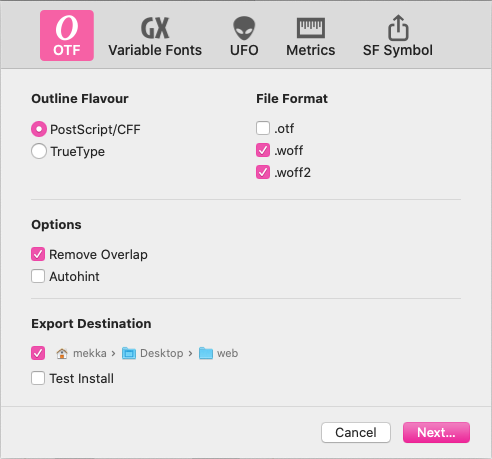
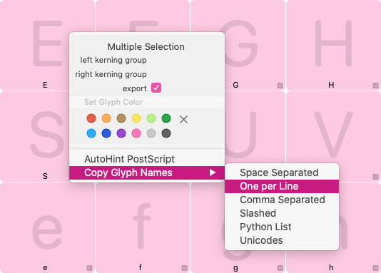
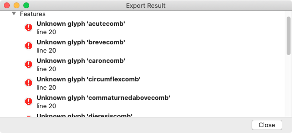

原文: [Webfonts](https://glyphsapp.com/learn/webfonts)
# Webフォント

チュートリアル

執筆者: Rainer Erich Scheichelbauer

[ en ](https://glyphsapp.com/learn/webfonts) [ fr ](https://glyphsapp.com/fr/learn/webfonts) [ zh ](https://glyphsapp.com/zh/learn/webfonts)

2022年8月17日更新（初版公開：2019年2月16日）

Webサイトでカスタムフォントを使いたいときは、いつでもWebフォントが必要です。そしてWebフォントを作成する際には、ファイルサイズが常に最大の関心事となります。ここでは、WOFFとWOFF2フォントを適切に作成する方法と、おまけの便利なヒントを学びましょう。

言うまでもなく、ファイルサイズは小さいほど良いです。適切にサブセット化された単一スクリプトのWebフォントは20KB未満に収まるべきで、それによって読み込みも速くなります。

## フォーマットの概要

最初に述べたように、第一の問題は*ファイルサイズ*です。リストの2番目は*ブラウザのサポート*です。残念ながら、すべてのWebブラウザがすべてのWebフォントファイル形式を扱えるわけではありません。Glyphsは、WOFF、WOFF2、そしてプレーンなOpenTypeフォント（TTF/OTF）の4種類のWebフォントを生成できます。以下に簡単な概要を示します。

*   **WOFF: Web Open Font Format。** *最も長くサポートされている形式で、古いブラウザに必要です。* Chrome 5、Firefox 3.6、IE9、Edge、Safari 5.1、Opera 11.1、Android WebKit 4.4、およびそれぞれのそれ以降のすべてのバージョンでサポートされています。[WOFFのサポートに関する詳細情報。](https://caniuse.com/#feat=woff)
*   **WOFF2: Web Open Font Format 2。** *圧縮率が最も高く、現在のブラウザで広くサポートされています。* Chrome 36、Firefox 39、Safari 10（macOS 10.13 High SierraおよびiOS 11以降のみ）、Edge 14、Opera 23、および現在のすべてのAndroidブラウザでサポートされています。Opera MiniとBlackBerryではサポートされていません。[WOFF2のサポートに関する詳細情報。](https://caniuse.com/#feat=woff2)
*   **プレーンOpenType: OTFとTTF。** *非常に古いブラウザバージョンのためのフォールバック形式です。* 当時WOFFをサポートしていなかったブラウザ用です。Chrome 4（0%）、Safari 3.2–5.0（macOSおよびiOS、0%）、Firefox 3.5（0.01%）、Opera 10.1–11.0（0%）、Android Browser 2.2（0%）。[TTFのサポートに関する詳細情報。](https://caniuse.com/#feat=ttf)

### レガシー

**EOT**（Embedded OpenType）がなぜないのか不思議に思うかもしれません。簡単な答え：必要ありません。

長い答え：EOTは長らく非推奨となっており、「Internet Explorer」というブラウザのWindows版で*のみ*動作していました。そのバージョン6から8まででしか必要ありませんでした（現在の合計市場シェアは0.09%未満で、それも測定の不正確さかもしれません）。Internet Explorerバージョン9（2011年リリース）以降はWOFFをサポートしています。[EOTのサポートに関する詳細情報。](https://caniuse.com/#feat=eot) Internet ExplorerはEdgeに置き換えられ、現在のEdgeのバージョンは技術的にChromeと同等です。

*プレーンOpenTypeは安全に無視して構いません*。ええ、実装しても害はありませんが、ね。これを書いている時点で、これらの形式を必要とするブラウザでのWeb閲覧は0.02%にも満たないでしょう。おそらく、あなたがこれを読んでいる頃にはさらに少なくなっているはずです。言い換えれば、WOFFとWOFF2に集中してください。では、読み進めましょう。

## Webフォントの書き出し

「ファイル > フォント情報 > 書き出し」で設定したフォントを書き出すには、単に「ファイル > 書き出し」（Cmd-E）を選び、上段のOTFオプションを選択します。すると、このようなダイアログシートが表示されます。



基本的には3つの決定を下す必要があります。

1.  **アウトライン形式：OpenType/CFF vs. TrueType。** ラジオボタンでフォントがどの形式で書き出されるかを決定します。TrueTypeベースのフォントはコンポーネントを使ってファイルサイズを小さく保ち、PSベースのフォントはサブルーチン化と呼ばれる技術を使います。[複雑なアウトライン](creating-fonts-with-complex-outlines.md)はサブルーチン化できません。Windowsでは複雑なPSアウトラインにパフォーマンスの問題があり、特にヒンティング（次の項目を参照）で画面レンダリングに違いが見られることがあります。両方を試し、ファイルサイズとレンダリング品質を比較して決定する必要があるかもしれません。

2.  **ファイル形式：.ttf/.otf、.woff、.woff2。** 上で説明したように、ファイルが書き出される形式です。`.ttf/.otf`（アウトライン形式による）オプションが、いわゆる*プレーン*バリアントです、もし不思議に思っていたなら。`.woff`と`.woff2`を選びましょう。

3.  **オートヒント：** 有効にすると、TT形式のフォントにはttfAutohintが使用され、PS/CFF形式のフォントにはAdobeのオートヒントアルゴリズムがそれぞれ適用されます。[複雑なフォント](creating-fonts-with-complex-outlines.md)にはヒンティングを適用できません。

4.  **オーバーラップを削除：** 製品版のフォントや、画面レンダリングをテストする際には常にオンにします。文字セットやOpenType機能のテストのために書き出しプロセスを高速化したい場合にのみ、オフにすることを検討してください。以下のプロのヒントを参照してください。

そして、はい、4番目の決定事項である「書き出し先」では、書き出しフォルダを事前に設定できます。これにより、通常なら表示される追加の保存ダイアログが不要になります。これは書き出しプロセスを大幅にスピードアップさせることができ、特にWOFFからさらに1キロバイトを絞り出そうと何度も再書き出しする場合には有効です。再度書き出すには、Cmd-Eを押してReturnキーを押すだけです。

### ヒント
「テストインストール」機能は使用しないでください。これはフォントを直接Macのランダムアクセスメモリに書き込みます。これはTextEditやPagesのようなCoreTextレンダラを使用するMacアプリでテストするためのものです。WOFFやWOFF2をRAMに書き出す意味はありません。

## カスタムパラメータ

以下のパラメータは、「ファイル > フォント情報 > 書き出し」または`.glyphsproject`ファイルで使用できます。

*   **Webfont Formats:** これにより、対象のインスタンスでどの形式を書き出すかを指定できます。Webフォントの生成を`.glyphsproject`ファイルにアウトソーシングする場合は、このパラメータを使用する必要があります。何をしているか分かっている場合を除き、常にWOFFとWOFF2を選択してください。そして、もしかしたら古いEOTやプレーンTTFファイルも加えてもいいかもしれません。
*   **Webfont Only:** フォント内のテーブルを、悪意のあるユーザーがWebフォントからOTFやTTFをリバースエンジニアリングするのを困難にするように調整します。しかし、私たちはお勧めしません。クライアントが追加の安全対策としてこれを主張する場合にのみ、このパラメータを使用してください。
*   **Remove post names for webfonts:** Webフォントの書き出し時にグリフ名を削除し、ファイルサイズをわずかに小さくします。ドット接尾辞を持つグリフ（OT機能用）が多い場合、長いプロダクションネームを引き起こすため、差が出るかもしれません。
*   **Save as TrueType:** 書き出しダイアログの*TrueType*オプションを強制的に選択します。
*   **Autohint:** 書き出しダイアログの*オートヒント*オプションを強制的に選択します。

しかし、待ってください、Webフォントマニア向けにもっと多くのカスタムパラメータがあります。読み進めてください。

## サブセット化

サブセット化とは、（不要な）グリフをフォントから削除し、それによってフォントのファイルサイズを少し小さくすることです。Glyphsでサブセット化を実現するには、基本的に互いに排他的な2つの方法があります。保持したいグリフを指定するか、削除したいグリフを指定するかのどちらかです。どちらの場合も、「ファイル > フォント情報 > フォント」または「ファイル > フォント情報 > 書き出し」、あるいは`.glyphsproject`ファイルでカスタムパラメータを使ってサブセット化を行います。

*   **Remove Glyphs:** グリフ名のリストを指定して、書き出されるWebフォントに含まれないグリフを指定します。すべてのグリフ名を改行で区切って入力するだけです。
*   **Keep Glyphs:** 上記と同じですが、今回は書き出したいグリフを指定します。このパラメータで言及されていないフォント内の他のすべてのグリフは書き出されません。

どちらの場合も、フォントタブ（Cmd-Opt-1）のコンテキストメニューから「グリフ名をコピー > 1行に1つ」コマンドを使用することで、作業をスピードアップできます。そして、クリップボードの内容をパラメータの値に貼り付けます。削除できない唯一のグリフは`.notdef`と`space`です。



そして、**アスタリスク**（*）をワイルドカードとして、単語の先頭と末尾の両方で使用できます。例えば、`ordfeminine`と`ordmasculine`を綴る代わりに`ord*`と書いたり、すべてのスタイルセット5のグリフに対して`*.ss05`と書いたり、さらにはすべてのスタイルセットに対して`*.ss*`と書いたりすることができます。

さらに良いことに、**キーワイルドカード**も利用できます。これにより、完全なカテゴリー、サブカテゴリー、さらにはスクリプトを、削除（または保持）するグリフのリストに追加できます。キーワイルドカードは、大文字と小文字を区別するグリフ情報キー（`script`、`unicode`、`category`、`subCategory`）と、それに続く等号、そしてキーに対応する適切な値で構成されます。例えば、すべてのギリシャ文字、すべての小文字、すべての数字を削除したい場合は、*Remove Glyphs*パラメータにこれらの行を追加します。

```
script=cyrillic
subCategory=Lowercase
category=Number
```

そして、キーワイルドカードとアスタリスクを組み合わせることもできます。例えば、Unicode値`U+0300`から`U+04FF`までのすべてのグリフを削除するには、パラメータの値にこれを追加します。

```
unicode=03*
unicode=04*
```

さて、サブセット化のためのツールを手に入れたところで、何を削除すればよいのでしょうか？いくつかヒントを挙げます。

*   スモールキャップ：`*.sc`
*   数字のバリエーション：`*.tf *.tosf *.osf *.lf`
*   スタイルセット：`*.ss*`
*   字形バリエーション：`*.cv*`
*   オーナメント：`*.ornm`
*   非常に稀で、非推奨、未使用、または入力不可能な文字：`AEacute aeacute Aringacute aringacute IJ ij napostrophe Oslashacute oslashacute`
*   地域化および互換性グリフ：`Tcedilla tcedilla Ldot ldot`
*   稀な記号：`lozenge paragraph currency florin logicalnot infinity integral product summation radical micro partialdiff perthousand registered trademark bar brokenbar dagger daggerdbl estimated apple`
*   Webサイトの用途に必要のない言語の文字。例えば、オランダ文学専門のページでは、エスペラントでのみ使用される追加のグリフはまず必要ないでしょう：`Ccircumflex ccircumflex Hcircumflex hcircumflex Jcircumflex jcircumflex`。
*   フォントの目的に必要のないスクリプトの文字。ブルガリア語のWebページですか？キリル文字、おそらく少しのラテン文字は必要ですが、フォントのギリシャ文字部分は必要ないでしょう。その場合は`script=greek`とします。

他に何かありますか？もちろんありますが、状況によって異なります。ですから、書き出し後は必ずグリフセットを確認し、他に削除できるグリフがないか見てください。そのためには、頻繁に書き出してテストするのが良い方法です。OTMasterやFontTableViewerのようなアプリでフォントを素早く開いたり、Wakamai FondueやFontDropのようなテストページで確認したりできます。詳細は後述します。不要なグリフがまだ残っていませんか？見逃されることはありません。

### プロのヒント
非常に頻繁に書き出しを行う場合は、オーバーラップの削除やヒンティングなしでプレーンOTFとして書き出してください。その方がはるかに速いです。完璧なサブセットができたら、本格的でプロダクションに対応したWOFFの書き出しに戻ることができます。

## 機能のサブセット化

サブセット化を行って書き出すと、このようなエラーダイアログが表示されることがあります。



このダイアログは、機能コード内に*不明なグリフ*があると報告しています。グリフ名（この例では`brevecomb`や他の結合アクセント）と、正確な場所（この例ではフォントの機能内の20行目）、そしてどの機能内のどの行か（この例では`ccmp`内の2行目）が言及されています。エラーの最も可能性の高い原因は、機能コード内にまだ存在するグリフ名が、サブセット化の過程で削除されたグリフを指していることです。言い換えれば、「ファイル > フォント情報 > 機能」の機能コードが、サブセット化されたインスタンスのグリフ構造と同期していないのです。

### プロのヒント
機能の自動サブセット化を行うための最良かつ最もマニアックな方法は、[トークン](tokens.md)です。これにより、すべてのトラブルを回避できます。

問題の機能が自動機能である場合、そもそもこれは起こらなかったはずです。しかし、複雑なカスタムパラメータをいろいろと使っている場合に起こることがあります。その場合は、インスタンスにこのカスタムパラメータを追加し、もちろんそのチェックボックスを有効にすることで、自動更新を強制する必要があるかもしれません。

*   **Update Features:** 有効にすると、すべての自動OpenType機能コード（クラスとプレフィックスを含む）を強制的に再生成します。

しかし、自動化されていない手動の機能コードがある場合は、これらのパラメータのいずれかを検討するとよいでしょう。

*   **Remove Prefixes:** プレフィックス名のリストを受け取り、書き出し時にそれらを削除します。
*   **Remove Classes:** OTクラス名のリスト（先頭のアットマークなし）を受け取り、書き出し時にそれらを削除します。
*   **Remove Features:** 4文字のOT機能タグのリストを受け取り、書き出し時にそれぞれの機能を削除します。
*   **Replace Prefixes:** サイドバーに表示されるプレフィックスの名前の後にセミコロン、その後に新しいコードを記述します。書き出し時に元のコードの代わりにこの新しいコードが挿入されます。
*   **Replace Classes:** OTクラスの名前（先頭のアットマークなし）の後にセミコロン、その後に新しいコードを記述します。書き出し時に元のコードの代わりにこの新しいコードが挿入されます。
*   **Replace Features:** 機能の4文字の機能タグの後にセミコロン、その後に新しいコードを記述します。書き出し時に元のコードの代わりにこの新しいコードが挿入されます。

## さらなるファイルサイズ削減

経験上、最も顕著な削減はサブセット化によって達成されますが、WOFFからさらに1、2キロバイトを絞り出す方法は他にもあります。Webフォントで最も重くなっている原因を見つけるには、WOFF内のテーブルがどれだけ大きいかを確認します。[fonttoolsをダウンロードしてインストール](https://github.com/fonttools/fonttools)し、ターミナルで`ttx -l fontname.woff`を実行してすべてのフォントテーブルをリスト表示するのが最善の方法です。あるいは、`ttx -l`とスペースを入力し、WOFFファイルをターミナルウィンドウにドラッグ＆ドロップしてファイルパスを挿入し、Returnキーを押します。すべてがうまくいけば、次のようなテーブルのリストが表示されます。

```
    tag     checksum    length    offset
    ----  ----------  --------  --------
    CFF   0x9C30A665     29398      2992
    GDEF  0x3C093D1F       189     32392
    GPOS  0x15445ACD     13356     32584
    GSUB  0x42EA82BB      1429     45940
    OS/2  0x68B4820A        78      1372
    cmap  0x8F4E4BFE      1042      1928
    head  0x12AB135E        52       292
    hhea  0x066A05BF        32      1340
    hmtx  0x1BC61668       994       344
    maxp  0x02435000         6       284
    name  0x76A3CF96       475      1452
    post  0xFFB80032        19      2972
```

length列を見てください：タグ`CFF`（Compact Font Format、PSアウトラインを持つ）のテーブルが最も多くのスペースを占めていることがわかります。それに僅差で`GPOS`（グリフの位置調整）が続きます。`CFF`、`cmap`、`hmtx`はフォント内のグリフ数に直接影響を受け、`GDEF`、`GPOS`、`GSUB`はフォント内のすべてのOT機能（カーニングを含む）から影響を受けます。`CFF`にはPostScriptヒンティング情報も保存されています。

典型的なTTベースのWebフォントを見てみましょう：

```
    tag     checksum    length    offset
    ----  ----------  --------  --------
    DSIG  0x00000001         8     14124
    GDEF  0x01C701B8        28       384
    GSUB  0x4C1A4D0D       492       412
    OS/2  0x697CB056        76       904
    cmap  0xEFD48A4D       628       980
    cvt   0x0CE0037F        40     12208
    fpgm  0x9E3611CA      1729     12248
    gasp  0x00000010         8     12200
    glyf  0xE8E7B58E      8718      1608
    head  0x112593E0        53     10328
    hhea  0x088C054F        32     10384
    hmtx  0xDBC80FBB       336     10416
    loca  0x668F76DC       216     10752
    maxp  0x033E0F25        32     10968
    name  0x6F5D0BBB       348     11000
    post  0x55CEA4FD       852     11348
    prep  0x6846C89C       143     13980
```

TrueTypeフォントでは、アウトライン情報は`glyf`テーブルに保存され、通常フォント内で最も大きなテーブルです。TTヒンティング情報は`prep`、`gasp`、`cvt`、`fpgm`に分散しています。

したがって、どこで最も多くのバイト数を数えるかに応じて、次にどのようなファイル削減手順を踏むかについて、情報に基づいた決定を下すことができます。いくつか提案します。

### ヒンティングを減らす：

TTベースのWebフォントを書き出し、オートヒントオプションを使用していますか？インスタンスに*TTFAutohint options*パラメータを追加し、可能な限り微調整してください。

*   ヒンティングを制限する：ttfAutohintは特定のPPMサイズに制限できます。できるだけ低く保ち、本当に違いが出るサイズでのみ使用するようにしてください。したがって、*Hinting Limit*を低く（例えば50未満に）保ち、最も重要なPPMサイズ（例えば12から32）のみを含む小さな*Hint set range*を使用します。
*   余分なものを避ける：*Hint composites、Adjust subglyphs、Detailed info、ttfa table*などの追加機能は通常必要なく、かなりのスペースを占める可能性があります。
*   *No Autohint Info*を有効にする：大したことではありませんが、ね。

CFFベースのWebフォントを書き出している場合は、最も必要なグリフにのみヒンティングを適用することを検討してください。*Disable autohinting for glyphs*というカスタムパラメータを検討し、ヒンティングから除外すべきグリフ名のリストを提供します。

フォントがAppleハードウェアのみ、または主にそれに対応するためのものである場合：ヒンティングを完全に削除するか、Appleデバイスにのみ配信されるヒンティングなしのバージョンも提供することを検討してください。もちろん、Web管理者がその方法を知っていればの話ですが。

### カーニングを減らす：

関与するグリフが削除されると、多くのカーニングが消えます。しかし、残ったカーニングがまだファイルサイズの負担になる可能性があります。

最も小さなカーニングペアを削除する。特定のしきい値までのものは削除できます。デザインによっては、それは5または10ユニットなどになります。[mekkablue scripts](http://github.com/mekkablue/Glyphs-Scripts)には、このタスクに役立つ*Metrics > Delete Small Kerning Pairs*があります。

言うまでもなく、これはフォントの*コピー*に対してのみ行ってください。

### マークのアタッチメント：

結合アクセントを削除するための*Remove Glyphs*パラメータを検討してください—もちろん、フォントがそれらに依存しないスクリプト（ラテン語、ギリシャ語、キリル文字など）を使用している場合に限ります。結合アクセントがないと、Glyphsは`mark`（Mark Attachment）および`mkmk`（Mark-to-Mark Attachment）機能を構築できなくなり、GPOSテーブルのサイズが小さくなります。これは、すべての`*comb`グリフを削除することで達成できます。

ただし注意してください、裏目に出ることがあります：TTベースのファイルは、ダイアクリティカルマークに結合アクセントをコンポーネントとして使用できなくなるため、*大きく*なる可能性があります。したがって、常にテストし、比較し、確認してください。ファイルサイズが大きくなる場合は、結合アクセントを削除する代わりに、次の内容で*Remove Features*パラメータを検討してください。

```
mark
mkmk
```

CFFベースのフォントは、そもそもコンポーネントを使用しないため、結合マークを削除すると常にスリムダウンするはずです。

### さらなる圧縮：

CFFベースのWOFFおよびWOFF2フォントでは、サブルーチン化を無効にすることも試せます。WOFFおよびWOFF2で使用される圧縮は、実際にはより効果的に機能することがあります。試す価値はあるので、インスタンスに*Disable Subroutines*パラメータを追加し、そのチェックボックスをオンにしてから、書き出してファイルサイズを測定してください。

## テスト

AdobeのMiguel Sousa氏によれば、テストされていないフォントは壊れたフォントであり、彼の言う通りです。しかし、Webフォントをどうやってテストするのでしょうか？もちろんブラウザでです：MacではSafari、Chrome、Firefox、WindowsではChrome、Edge、Firefoxで。そして、どうやって「ブラウザでテスト」するのでしょうか？いくつかの選択肢があります。

まず、書き出し直後に、*ウィンドウ > プラグインマネージャ > スクリプト*から利用可能な[mekkablue scripts](http://github.com/mekkablue/Glyphs-Scripts)から*Test > Webfont Test HTML*を実行できます。これは、Webフォントを書き出した最新のフォルダ内に、現在のファイル（.glyphsまたは.glyphsproject）用のHTMLファイルを作成します。そして、そのHTMLをすぐにデフォルトのブラウザで開いてくれます。そこでOT機能を有効にしたり、テストテキストを入力したり、いくつかのサイズでフォントを見たりすることができます。サンプルCSSコードも提供してくれます。

または、完成したWOFFをViktorとClemens Nübel氏の素晴らしい[FontDrop](https://fontdrop.info)にドラッグすることもできます。これは彼らがMonotypeのために開発したものです。WOFFをドラッグすれば、フォント全体の概要が表示されます。フォント情報、ヒンティング（ウォーターフォール表示付き）、グリフセットのテストに適しています。なんと、スペーシングインジケーターまで提供してくれます！欠点：まだWOFF2をサポートしていません。

これと同様に、Roel Nieskens氏の天才的な[Wakamai Fondue](https://wakamaifondue.com)テストページを使いたいかもしれません。OT機能のテストにはめちゃくちゃ優れており、コピー＆ペーストが楽しくなるサンプルHTMLおよびCSSコードまで提供してくれます。

そして、Just van Rossum氏による素晴らしい[Font Goggles](https://fontgoggles.org)アプリがあります。WOFFやWOFF2を含む、あらゆる種類のフォント形式をサポートしています。

Simon Cozens氏の[Crowbar](http://www.corvelsoftware.co.uk/crowbar/)は、シェーピング/レイアウトの問題をデバッグするためのオンラインツールで、Webフォントもサポートしています。CrowbarはHarfbuzzを使用してテキストをシェーピングし、OT機能の適用中のさまざまな段階で何が起こっているかを正確に見ることができます。

---

更新履歴 2019-07-30: 誤字を修正。（Nathalieさん、ありがとう。）

更新履歴 2020-09-22: Glyphs 3向けに更新。

更新履歴 2020-11-13: Glyphs 3向けに更新、Font GogglesとCrowbarを追加。

更新履歴 2020-12-04: 軽微なフォーマットの変更、更新、誤字の修正。

更新履歴 2022-17-08: 軽微なフォーマットの変更。

## 関連記事

[すべてのチュートリアルを見る →](https://glyphsapp.com/learn)

*   ### [アイコンWebフォントの作成](creating-an-icon-webfont.md)

    チュートリアル

[ Glyphs Mini ](https://glyphsapp.com/learn?q=glyphs+mini)

*   ### [Glyphs MiniでWebフォントを作成する](creating-a-webfont-in-glyphs-mini.md)

    チュートリアル

[ Glyphs Mini ](https://glyphsapp.com/learn?q=glyphs+mini)