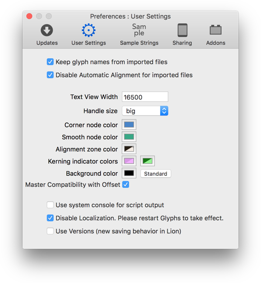
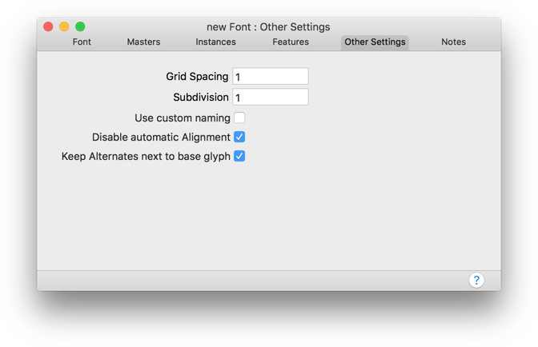
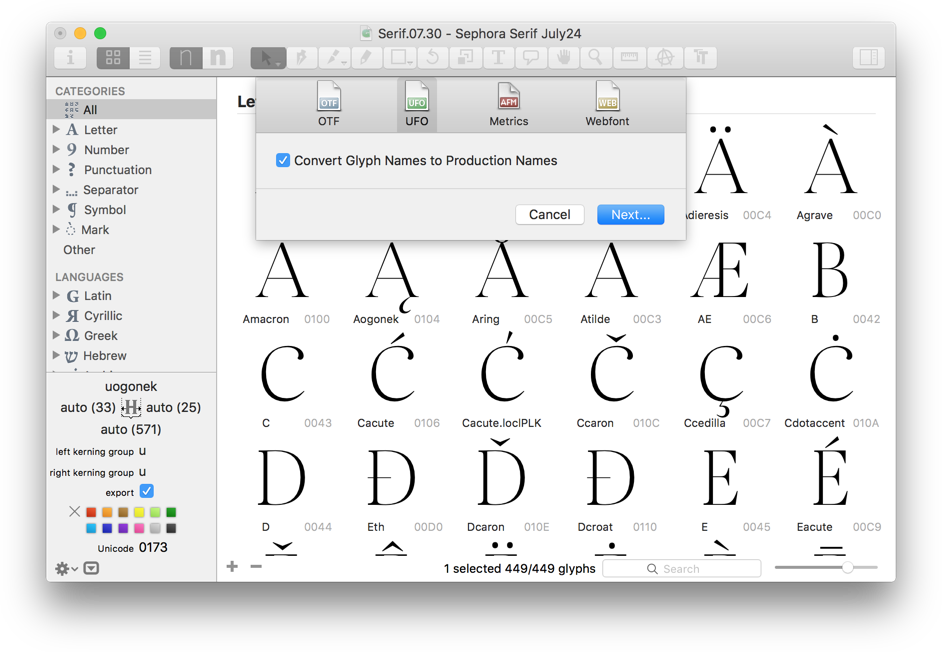
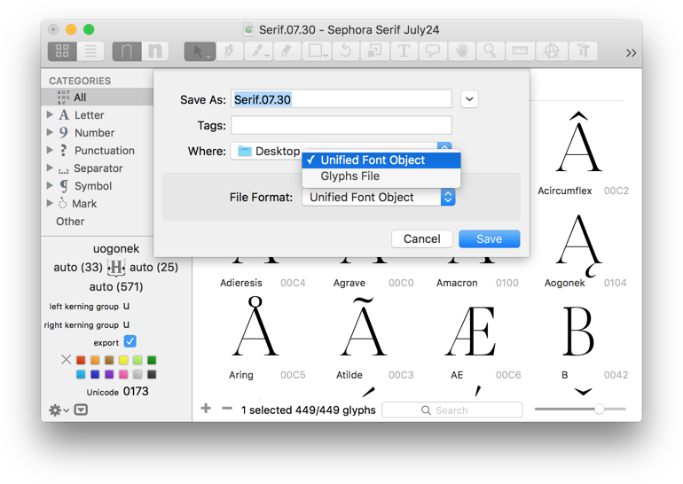
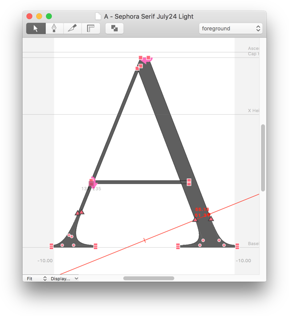
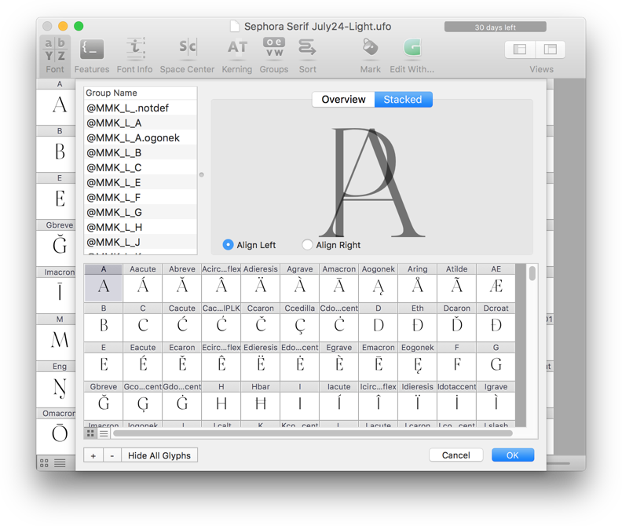
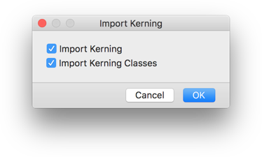

原文: [Working with UFO](https://glyphsapp.com/learn/working-with-ufo)
# UFO形式のファイルを扱う

旧バージョンのチュートリアル

[ インストール ](https://glyphsapp.com/learn?q=installation)

執筆者: Rainer Erich Scheichelbauer

[ en ](https://glyphsapp.com/learn/working-with-ufo) [ zh
](https://glyphsapp.com/zh/learn/working-with-ufo)

2022年8月1日更新（初版公開：2014年11月25日）

統一フォントオブジェクト（Unified Font Object、UFO）は、フォントデータを保存するためのフォーマットで、フォント制作に革命をもたらしました。ここでは、GlyphsをUFOワークフローに統合し、他のアプリの機能を活用する方法を紹介します。

[統一フォントオブジェクト（Unified Font Object）](http://unifiedfontobject.org)は、フォントデータを保存するためのXMLベースのファイル形式です。書体デザイナー兼開発者であるTal Leming氏、Just van Rossum氏、Erik van Blokland氏によって開発されました。[バージョン3の仕様](http://unifiedfontobject.org/versions/ufo3/index.html)も公開されていますが、現在最も広く使われているのは[UFO 2](http://unifiedfontobject.org/versions/ufo2/index.html)です。

Glyphsだけでフォントやフォントファミリーを制作することもできますが、UFO形式を使えば他のツールとの連携が可能になります。UFOによって、さまざまな他のツールを利用できるようになるのです。だからこそ、Glyphsは標準でUFOをサポートしています。そもそもなぜそんなことをしたいのでしょうか？答えは簡単です。一般的に、UFOツールは特定のタスクに特化した高度な専門アプリだからです。つまり、そうしたツールはGlyphsのアプリ内機能が及ばない部分を補ってくれるのです。いくつかの例を以下でご紹介します。

## UFOにはすべてが保存されるわけではない

心に留めておくべきことの一つは、コンポーネントの自動アラインメントの有効/無効設定や、[ブラケット・トリック](alternating-glyph-shapes.md)のような多くのGlyphs特有の設定は、UFOファイルには保存できないということです。そのため、特に注意を払い、必要に応じてファイルを再確認してください。

非常に重要：UFOは_単一のマスター_です。マルチプルマスターの情報は、1つのUFOファイル内に保存することはできません。つまり、インターポレーションを行いたい場合は、マスターごとに1つのUFOファイルを使用する必要があります。

## 環境設定とファイル設定

UFOワークフローを活用する準備をしたい場合、「Glyphs > 環境設定 > ユーザー設定（Glyphs > Preferences > User Settings）」に2つの重要なオプションがあります。これらに共通しているのは、Glyphsで開かれるすべての非ネイティブファイル（`.ufo`拡張子を持つファイルなど）に適用されるという点です。

まず、「読み込んだファイルのグリフ名を維持（Keep glyph names from imported files）」オプションを有効にすると、Glyphsがグリフ名を独自の命名規則に変換するのを防ぎます。Glyphsだけのワークフローでは、[内部の命名規則に従うことには特定の利点があります](getting-your-glyph-names-right.md)。しかし、アプリケーション間を頻繁に行き来する場合は、通常、ファイルに設定されている名前を維持したいと思うでしょう。

次に、ファイル内のコンポーネントの配置を維持したい場合があるかもしれません。言い換えれば、Glyphsが合成文字の自動アラインメントを強制するのを防ぎたい場合です。その場合は、「読み込んだファイルで自動アラインメントを無効にする（Disable automatic alignment in imported files）」オプションを選択するのが良いでしょう。

これら2つの設定は、「ファイル > フォント情報 > その他（File > Font Info > Other Settings）」にある対応する2つのオプション、すなわち「カスタム命名規則を使用（Use custom naming）」（古いバージョンのGlyphsでは「ナイスネームを使用しない（Don’t use nice names）」）と「自動アラインメントを無効にする（Disable automatic alignment）」を設定するものです。もちろん、これらのオプションはそこで手動で設定することもできます。

もちろん、逆の方向、つまり`.glyphs`ファイルをUFOで利用する場合には、設定をデフォルトのままにして、自動アラインメントとナイスネームの利点を最大限に活用することができます。

さて、準備が整ったところで、UFOファイルと本格的に向き合ってみましょう！

## UFOの書き出し

現在のフォントプロジェクトのUFOコピーを作成したい場合は、「ファイル > 書き出し > UFO（File > Export > UFO）」を選択します。表示されるダイアログで、グリフ名をプロダクションネームに変換するかどうかを選択でき、次のダイアログでUFOファイルを保存する場所を選択します。

「グリフ名をプロダクションネームに変換（Convert Glyph Names to Production Names）」オプションは、キリル文字の大文字Zheに対する`Zhe-cy`のような人間が読みやすいナイスネームを、`uni0416`のような業界標準の名前に変換します。これらの名前は覚えにくいかもしれませんが、互換性が高くなります。ツールによっては、これらの名前が設定されていることを期待するものもあります。私たちからのアドバイスは、まずはナイスネームでワークフローを試してみて、それで上手くいかない場合に名前を変換するという方法です。

## 保存形式としてのUFO

すでにUFOファイルをお持ちの場合は、Glyphsでそれを開き、UFOモードのまま作業できます。保存（Cmd-S）すると、直接UFOファイルに保存されます。

また、「ファイル > 別名で保存…（File > Save As…）」（Cmd-Shift-S）を使って、最前面にあるファイルのコピーをUFOとして保存することもできます。そのためには、書き出しダイアログでファイルフォーマットとして「Unified Font Object」を選択する必要があります。例えば、対象のファイルに複数のマスターがある場合など、UFOとして保存できない場合にはGlyphsが警告を表示します。その場合は、「ファイル > 書き出し（File > Export）」（Cmd-E）を使用する必要があります。

UFOファイルの準備ができれば、多数の専門的なアプリケーションやツールで作業する準備が整ったことになります。

## RoboFont

ベルギーの書体デザイナーFrederik Berlaen氏によるUFOエディタ[RoboFont](http://doc.robofont.com/)は、究極のワークフロー柔軟性を目指してゼロから構築されました。それを実現するために、彼は学びやすいプログラミング言語Pythonで独自のツールを非常に簡単に構築できるようにしました。当然のことながら、RoboFont用には、[GitHub](https://github.com/search?q=robofont&type=Repositories&ref=searchresults)やウェブ上の他の場所で、多種多様なプラグインやスクリプトが利用可能です。多くの拡張機能は[RoboFontのウェブサイト](http://doc.robofont.com/extensions/)自体にもリストされています。その基盤となるAPIの強力さを知るには、[Loïc Sander氏の「パラメトリックな書体デザインにおける実験」のビデオ](http://vimeo.com/107578077)をご覧ください。

## MetricsMachine

Tal Leming氏の[MetricsMachine](http://tools.typesupply.com/metricsmachine.html)は、カーニングに完全に特化したアプリです。カーニンググループやカーニングペアの作成に特化したツール、スタックビュー、自動的に適応するコンテキスト文字列、さまざまなプリセットなどを備え、このアプリはGlyphsよりも体系的で分析的なカーニングへのアプローチを提供します。

このアプリは、選択したグリフからすべての可能なカーニングペアを作成するための「ペアリストビルダー」を搭載しています。ペアを設定したら、上下矢印キーでカーニングリストを順に見ていき、左右矢印キーで10ユニット単位でカーニングを調整し、Shiftキーを押しながらで5ユニット単位、Optionキーで1ユニット単位で調整します。最後に、スプレッドシート機能がカーニングテーブルを把握するのに役立ちます。心ゆくまでフィルタリングや分析ができます。

一つ小さな注意点があります。Glyphsで_右_グループ（グリフのどちら側が関わるかに基づく）と呼ばれるものが、MetricsMachineでは_左_グループ（カーニングペアのどちら側かに基づく）と呼ばれています。

ちなみに、MetricsMachineはGlyphsだけのワークフローに組み込むこともできます。必要なのは、UFOを書き出し、MetricsMachineでカーニングすることだけです。そして、すべてのグリフを選択して「ファイル > 読み込み > メトリクス…（File > Import > Metrics…）」を選択することで、すべてのカーニング情報をGlyphsファイルに戻すことができます。表示されるダイアログで、カーニングだけを読み込むか、カーニンググループも読み込むかを選択します。

重要：影響を受けるべきすべてのグリフは、読み込む前に_選択されている必要があります_。したがって、おそらく最も良い方法は、単にすべてのグリフを選択してから読み込むことです。

## Superpolator

[Glyphsだけでマルチプルマスターを行うこともできます](multiple-masters-part-1-setting-up-masters.md)が、Erik van Blokland氏の[Superpolator](http://superpolator.com/)は、インターポレーションとエクストラポレーションの全く新しい世界を開きます。このアプリは完全にインターポレーションに特化しているため、[即時プレビュー](http://new.superpolator.com/documentation/glyph-preview/)や[ライブ計測](http://new.superpolator.com/measuring-is-awesome/)オプション、任意の数の軸上に任意の数のマスター、任意の数のグリフに対する個別のインターポレーションなど、思いのままです。簡単な紹介として、[Robothon 2012でのErik氏によるSuperpolator 3のプレゼンテーション](http://vimeo.com/38266893)をご覧ください。

## その他のUFOツール

実際、これらはUFOベースのアプリケーションのほんの3つの例にすぎません。注意深く見ていれば、RoboFontの作者であるFrederik Berlaen氏の[roundingUFO](http://roundingufo.typemytype.com)のように、インクトラップを作成するのに非常に便利なツールなど、多くのツールを見つけることができるでしょう。そして、Superpolatorの世界に飛び込みたいのであれば、Tal Leming氏の[Prepolator](http://tools.typesupply.com/prepolator.html)が、インターポレーション用のUFOファイルを準備するのに役立ちます。

興味深いことに、多くのコマンドラインツールもUFOファイルで動作します。例えば、[ufo2otf](https://github.com/fonts/ufo2otf)を見てください。これは、UFOから直接、すぐに使えるWebフォントやOTFをコンパイルできます。OpenTypeといえば、Adobe自身の[Font Development Kit for OpenType](http://www.adobe.com/devnet/opentype/afdko.html)もUFOファイルを利用できます。それを利用する場合、Tal Leming氏の[ufo2fdk](https://github.com/typesupply/ufo2fdk)が役立つでしょう。

## FontLabとの連携にUFOは使わない

ただし、Glyphsと[FontLab Studio](http://www.fontlab.com/font-editor/fontlab-studio/)の間でフォントプロジェクトを移動させたい場合、途中で多くの情報が失われる可能性があるため、UFOを交換フォーマットとして使用するのは良い考えではありません。この場合は、[Georg氏がGitHubリポジトリで提供しているFontLab Studio用のGlyphsインポートおよびGlyphsエクスポートマクロ](https://github.com/schriftgestalt/Glyphs-Scripts)を使用する方が良いでしょう。

FontLabの新しいバージョン、具体的にはバージョン6以降では、.glyphsファイルを直接開くことができます。

---

更新履歴 2022-08-01: タイトル、関連記事、軽微なフォーマットを更新。

更新履歴 2022-08-03: 末尾にFontLab 6+に関するバージョンノートを追加。

## 関連記事

[すべてのチュートリアルを見る →](https://glyphsapp.com/learn)

*   ### [既存フォントの読み込み](importing-existing-fonts.md)

    チュートリアル

[ トラブルシューティング ](https://glyphsapp.com/learn?q=troubleshooting)

*   ### [Illustratorからの読み込み](importing-from-illustrator.md)

    チュートリアル

*   ### [IllustratorからGlyphs Miniへの読み込み](importing-from-illustrator-into-glyphs-mini.md)

    チュートリアル

[ Glyphs Mini ](https://glyphsapp.com/learn?q=glyphs+mini)

*   ### [Glyphsへの移行](porting-to-glyphs.md)

    チュートリアル